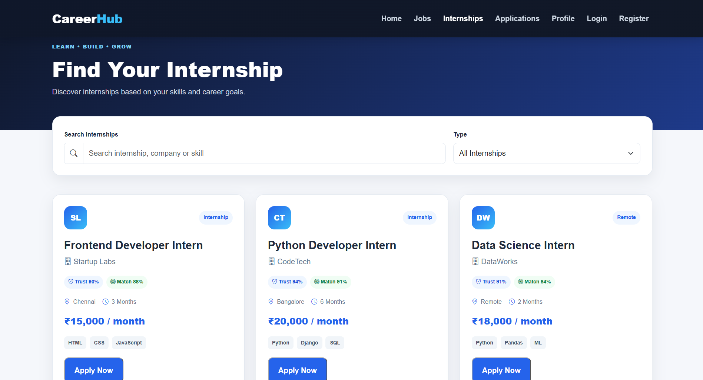

# 💼 Job Portal System

## 📌 Project Description

A responsive Job Portal System developed using HTML, CSS, Bootstrap, and JavaScript. The system helps users explore job and internship opportunities, search for suitable positions, and manage their career profiles through a simple and user-friendly interface.

## 🔴 Problem Statement

Students and job seekers often face difficulty finding suitable job and internship opportunities across multiple platforms. Searching, filtering, and managing career opportunities can be time-consuming. This project provides a simple centralized platform to make the job-search process easier and more organized.

## 📖 Synopsis

The Job Portal System is a web-based application designed to help users discover job and internship opportunities in one place. Users can browse available opportunities, search for specific jobs, view job details, apply for opportunities, and manage their profiles.

The project focuses on providing a clean, responsive, and user-friendly interface using modern frontend technologies.

## 🛠️ Technologies Used

- HTML5
- CSS3
- Bootstrap 5
- JavaScript
- LocalStorage

## ✨ Features

- 🔐 User Registration and Login
- 👤 User Profile Management
- 🔎 Job Search
- 💼 Job Listings
- 🎓 Internship Listings
- 🎯 Search and Filter Opportunities
- 📄 Job Details
- 📋 Job Applications
- 💾 LocalStorage Integration
- 📱 Responsive Design
- 🎨 User-Friendly Interface
- 🚀 Easy Navigation

## 📸 Screenshots

### 🏠 Home Page

### 💼 Jobs Page

### 🎓 Internships Page

### 📋 Applications Page

### 🔐 Login Page

### 👤 Profile Page

### 📝 Register Page

## 🔮 Future Enhancements

- Backend integration using Java, Spring Boot, or Node.js
- MySQL database integration
- Secure user authentication
- Resume upload and management
- Online job application system
- Recruiter and employer dashboards
- Email notifications
- AI-based job recommendations
- Advanced job filtering
- Admin dashboard

## 📄 License

This project is created for educational and academic purposes.

## 👤 Author

**Priyanka Gandhi**

GitHub: [PriyankaGandhi24116](https://github.com/PriyankaGandhi24116)

LinkedIn:
(https://www.linkedin.com/in/priyanka-gandhi-b951b2436)

## 📝 Conclusion

The Job Portal System provides a simple and efficient platform for users to discover job and internship opportunities. The project demonstrates the practical use of HTML, CSS, Bootstrap, and JavaScript to build a responsive and interactive web application.

With future backend and AI integration, the project can be developed into a complete career management platform.
